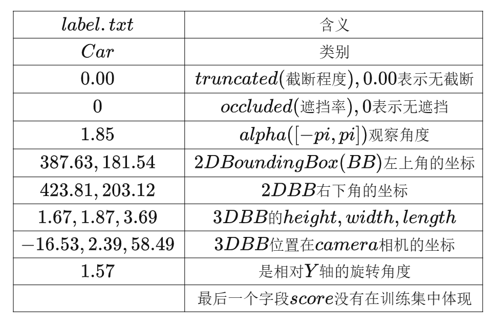

# tools introduction
数据准备工具包，包含数据的统计，点云和标签的转换以及训练集和测试集的划分等功能。

### 1. 标签统计
statistics  
统计点云文件的标签数量

### 2. 点云和标签转化
1. 点云文件转化，sustechscapes_to_kitti， pcd >>> bin
2. 标签文件转化，trans_json_to_kitti, json >>> txt   
将标签工具生成的json文件转化为KITTI数据集使用txt格式  
相比于KITTI数据集，本项目只有点云文件，没有图像文件，因此需要进行将标签转化到点云坐标系下，对比如下：
3. KITTI数据集标签介绍：  

4. 本项目数据集介绍：
本项目主要将KITTI数据集在相机坐标系下的坐标转化为点云坐标下的坐标，包括12,13,14三个参数，其余参数和KITTI数据集保持一致。

### 3. 数据集划分
将数据集划分为训练集和测试集

### 4. 计算预设框的长宽高
通过k—means聚类统计不同类别的长宽高，包括人和车的长宽高，有助于提高人车检测的召回率